# Data structures and algorithms, in plain language

A study article based on [Bro Code’s Data Structures and Algorithms full course](https://www.youtube.com/watch?v=CBYHwZcbD-s) (about 4 hours, Java).

This text follows the same chapter order. The examples are C#. C# is close to the Java in the course, and the built-in types have the same jobs. A short Go note appears where a Go slice is the clearer picture.

The writing uses the useful parts of ASD-STE100 (Simplified Technical English):

- One idea in each sentence.
- Active voice.
- The same word for the same thing.
- A definition before the first technical use.

It is not a certified STE document. Programming needs words that STE would ban, such as "algorithm" and "node".

You do not need more source material for this pass. A transcript would help only if you want a line-by-line study sheet for one chapter.

---

## How to read this

Read sections 1 to 7 if the words are new. Read section 8 before the search and sort sections. Use the decision table at the end when you choose a structure.

| Course time | Topic |
| --- | --- |
| 0:00 | What these words mean |
| 0:02 | Stacks |
| 0:11 | Queues |
| 0:21 | Priority queues |
| 0:26 | Linked lists |
| 0:40 | Dynamic arrays |
| 1:04 | Linked list vs array list |
| 1:13 | Big O |
| 1:19 | Linear search |
| 1:23 | Binary search |
| 1:32 | Interpolation search |
| 1:41 | Bubble sort |
| 1:48 | Selection sort |
| 1:56 | Insertion sort |
| 2:03 | Recursion |
| 2:11 | Merge sort |
| 2:25 | Quick sort |
| 2:38 | Hash tables |
| 2:52 | Graphs |
| 2:57 | Adjacency matrix |
| 3:07 | Adjacency list |
| 3:15 | Depth-first search |
| 3:23 | Breadth-first search |
| 3:30 | Trees |
| 3:33 | Binary search trees |
| 3:53 | Tree traversal |
| 3:57 | Measure execution time |

The link in your request opens the course near 2:39, at the start of hash tables.

---

## 1. Two words

A **data structure** is a named place that stores data and keeps an order. A family tree is a structure. An array is a structure. Each structure has a different shape, so each structure makes some jobs cheap and other jobs costly.

An **algorithm** is a list of steps that solves one problem. A pizza recipe is an algorithm: heat the oven, shape the dough, add the toppings, bake. The problem is hunger. The steps are the solution.

You learn both for two reasons:

1. The program uses less time and less memory.
2. Interviews ask these questions. "Reverse a linked list" is a common one.

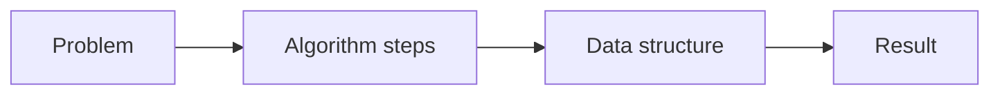

---

## 2. Stack

A stack is a last-in, first-out structure. People shorten that to LIFO.

Picture a stack of books. You put a book on top. You take a book from the top. You do not pull a book from the middle.

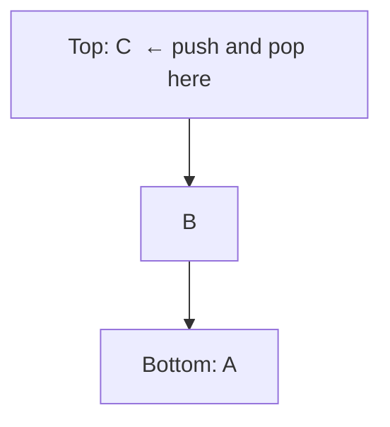

Five operations:

| Name | What it does |
| --- | --- |
| Push | Add an item on top |
| Pop | Remove the top item and return it |
| Peek | Read the top item, and leave it there |
| IsEmpty | Tell you if the stack has no items |
| Search | Look for an item |

C# already has this type:

```csharp
var books = new Stack<string>();
books.Push("A");
books.Push("B");
books.Push("C");

string top = books.Peek(); // "C"
string last = books.Pop(); // "C"
bool none = books.Count == 0;
```

Use a stack for an undo button, a browser Back button, or the call stack. The call stack is the stack that remembers which method called which method.

Do not use a stack when the oldest item must leave first. That job belongs to a queue.

---

## 3. Queue

A queue is a first-in, first-out structure. People shorten that to FIFO.

Picture a line for concert tickets. The first person in line is the first person who buys a ticket. New people join at the back.

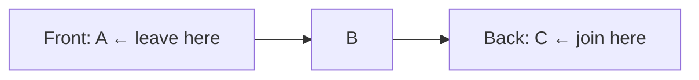

| Name in this article | C# name | What it does |
| --- | --- | --- |
| Enqueue | `Enqueue` | Add at the back |
| Dequeue | `Dequeue` | Remove from the front |
| Peek | `Peek` | Read the front item |

```csharp
var line = new Queue<string>();
line.Enqueue("Ada");
line.Enqueue("Lin");
string next = line.Dequeue(); // "Ada"
```

Use a queue for a print queue, a keyboard buffer, or a list of jobs. A buffer holds data until the program can process it.

---

## 4. Priority queue

A priority queue is a queue that does not use arrival time. Each item has a priority. The item with the best priority leaves first.

Picture a hospital. A heart attack does not wait behind a small cut.

In .NET, a smaller priority number leaves first.

```csharp
var er = new PriorityQueue<string, int>();
er.Enqueue("small cut", 3);
er.Enqueue("heart attack", 1);
er.Enqueue("broken arm", 2);

string next = er.Dequeue(); // "heart attack"
```

The usual inner structure is a heap. You do not need to build a heap to use the type. You do need to know this: insert and remove are about O(log n), not O(1). Section 8 defines O.

Use a priority queue for tasks, emergency order, or "next closest" steps in some path algorithms.

---

## 5. Linked list

A linked list is a chain of nodes. A node holds a value and a link to the next node.

```mermaid
flowchart LR
    a[10 | next] --> b[20 | next] --> c[30 | null]
```

The first node is the head. The last node points to nothing. In C# that "nothing" is `null`.

A singly linked list has one direction: next. A doubly linked list also has a link to the previous node. The extra link makes "go back" cheap. It also uses more memory.

`LinkedList<T>` in C# is doubly linked.

```csharp
var list = new LinkedList<int>();
list.AddLast(10);
list.AddLast(20);
list.AddFirst(5);          // head becomes 5
list.Remove(20);
```

Why people build one by hand in class:

- Insert or delete at the head does not move the other items.
- There is no single block of memory. Each node can sit anywhere.
- You cannot jump to item 500. You walk from the head. That walk costs more as the list grows.

Go does not ship a linked list in the standard library. Use a slice unless you have a measured reason to write nodes yourself.

---

## 6. Dynamic array

A normal array has a fixed size. You choose the size when you create it. You cannot add a sixth item to an array of five.

A dynamic array grows. C# calls it `List<T>`. Java calls it `ArrayList`. Go calls it a slice.

The trick: the list keeps a hidden array with extra empty slots. That hidden size is the capacity. The number of real items is the count.

When you add an item and the capacity is full, the list does this:

1. Allocate a new array. The new capacity is often double the old capacity.
2. Copy the old items.
3. Add the new item.
4. Drop the old array.

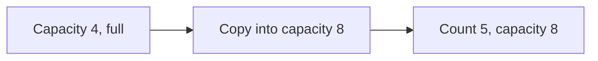

```csharp
var names = new List<string>(capacity: 4);
names.Add("Ann");
names.Add("Bo");
Console.WriteLine(names[0]); // index read, cheap
names.Insert(0, "Cy");       // shifts Ann and Bo right
```

Most adds at the end are cheap. The rare copy is costly, but it happens less and less often. Across many adds, the average add is still cheap.

Go:

```go
names := make([]string, 0, 4)
names = append(names, "Ann")
```

`append` grows the slice for you. The idea is the same: capacity, then a copy when the slice is full.

---

## 7. Linked list or array list?

Use the shape of the job, not habit.


| Job | `List<T>` | `LinkedList<T>` |
| --- | --- | --- |
| Read item at index i | Cheap | Costly. You walk i steps |
| Add at the end | Cheap on average | Cheap if you keep the tail |
| Insert at the front | Costly. Items shift | Cheap |
| Search by value | Costly | Costly |
| Memory | One block, good for the CPU cache | Extra link fields, nodes can be scattered |
| Extra space | Some empty slots | One or two links per node |

The course comparison is the same point: an array list is the default. A linked list wins when you insert or delete at the ends often, and you do not need random index access.

CPU cache means the processor reads nearby memory quickly. An array keeps items together. A linked list does not.

---

## 8. Big O

Big O describes how the work grows when the input grows. It is not the time in milliseconds. It is the shape of the growth.

We talk about the worst common case, and we drop constant factors. `3n + 10` is O(n). The `3` and the `10` do not change the shape.

| Name | Plain meaning | Example |
| --- | --- | --- |
| O(1) | The work stays flat | Read `list[i]`, stack push |
| O(log n) | The work grows very slowly | Binary search |
| O(n) | The work grows in a straight line | Linear search |
| O(n log n) | A bit more than a straight line | Merge sort, quick sort on average |
| O(n²) | The work grows with pairs | Bubble sort |


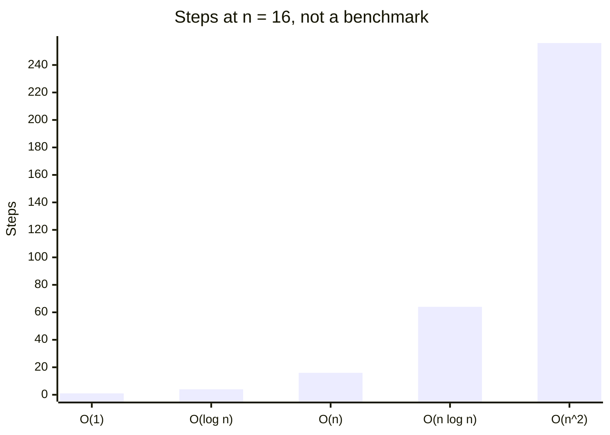

A method can have more than one cost. Insert into a dynamic array is O(1) on average and O(n) on the rare copy. Say which case you mean.

---

## 9. Linear search

Linear search checks each item until it finds the target, or until the data ends.

```csharp
static int LinearSearch(int[] data, int target)
{
    for (int i = 0; i < data.Length; i++)
    {
        if (data[i] == target)
            return i;
    }
    return -1;
}
```

The cost is O(n). Use it when the data is small or not sorted. Sorting first can cost more than one scan.

---

## 10. Binary search

Binary search needs sorted data. It looks at the middle item. If the target is smaller, it ignores the right half. If the target is larger, it ignores the left half. It repeats.

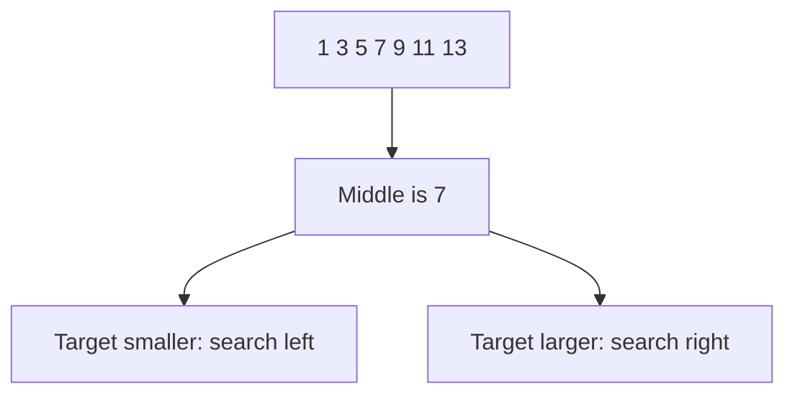

```csharp
static int BinarySearch(int[] data, int target)
{
    int low = 0;
    int high = data.Length - 1;
    while (low <= high)
    {
        int mid = low + (high - low) / 2;
        if (data[mid] == target)
            return mid;
        if (data[mid] < target)
            low = mid + 1;
        else
            high = mid - 1;
    }
    return -1;
}
```

The cost is O(log n). Each step cuts the problem in half. `low + (high - low) / 2` avoids an overflow that ` (low + high) / 2 ` can cause on large indexes.

C# also has `Array.BinarySearch`. The data must already be sorted. Binary search on unsorted data returns a wrong answer, not a slow answer.

---

## 11. Interpolation search

Interpolation search is binary search with a guess. Binary search always picks the middle. Interpolation search estimates where the value should sit, like a person who opens a phone book nearer to "S" than to the middle when the name starts with S.

The position estimate is:

```text
low + (target - data[low]) * (high - low) / (data[high] - data[low])
```

It is fast when the values are sorted and spread evenly. The average cost can be about O(log log n). The worst cost is O(n) if the values are clustered. Do not use it on unsorted data. Do not use it as the default. Binary search is the safer tool.

---

## 12. Three simple sorts

These three sorts are easy to see. They are O(n²). They are fine for tiny data and for learning. They are the wrong default for large data.

### Bubble sort

Compare neighbors. If they are out of order, swap them. Repeat until a pass makes no swap.

```text
5 1 4 2
1 5 4 2
1 4 5 2
1 4 2 5
```

The large values "bubble" to the end.

### Selection sort

Find the smallest item. Swap it into position 0. Find the smallest of the rest. Swap it into position 1. Repeat.

Selection sort does few swaps. It still looks at almost every pair, so it is still O(n²).

### Insertion sort

Keep a sorted part on the left. Take the next item. Insert it into the correct place in that sorted part.

Insertion sort is still O(n²) in the worst case. It is fast when the data is already almost sorted, because each item only moves a short distance.

```csharp
static void InsertionSort(int[] data)
{
    for (int i = 1; i < data.Length; i++)
    {
        int current = data[i];
        int j = i - 1;
        while (j >= 0 && data[j] > current)
        {
            data[j + 1] = data[j];
            j--;
        }
        data[j + 1] = current;
    }
}
```

---

## 13. Recursion

A recursive method calls itself. It needs a base case. The base case is the stop condition. Without it, the method calls itself until the call stack overflows.

```csharp
static int Factorial(int n)
{
    if (n <= 1)
        return 1;                 // base case
    return n * Factorial(n - 1);  // smaller problem
}
```

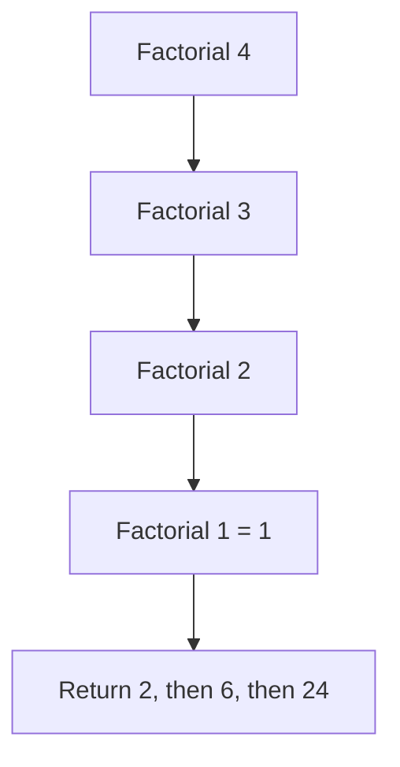

Use recursion when the problem is the same shape at a smaller size: a folder tree, a divide-and-conquer sort, a graph walk. Prefer a loop when the recursion is only a counter. A loop uses less stack space.

---

## 14. Merge sort

Merge sort is divide and conquer.

1. Split the data into two halves.
2. Sort each half. This is the recursive call.
3. Merge the two sorted halves into one sorted result.

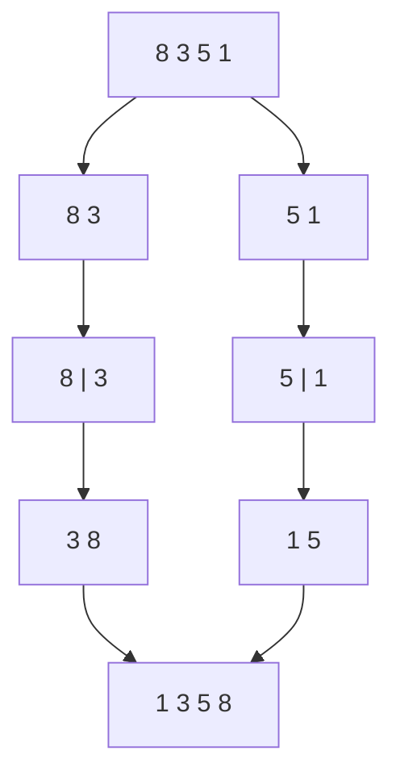

The cost is O(n log n) in the best, average, and worst case. It is stable: equal items keep their original order. It needs extra memory for the merge. That is the trade.

---

## 15. Quick sort

Quick sort picks a pivot. It partitions the data. Items smaller than the pivot go left. Items larger than the pivot go right. It then sorts the two sides.

```text
Data:  5 2 9 1 7     pivot = 5
After: 2 1  5  9 7
       left   right
```

Average cost is O(n log n). Worst cost is O(n²) if the pivot is always the smallest or largest item. A random pivot, or a median pivot, makes the worst case rare. Quick sort uses little extra memory. It is often faster than merge sort in practice because it moves items inside the same array. It is not stable.

In real C# code, call `Array.Sort`. The library sort is tuned. Write quick sort when you need to learn it, not when you need a production sort.

---

## 16. Hash table

A hash table stores a value under a key. C# calls it `Dictionary<TKey, TValue>`. Java calls it `HashMap`. Go calls it a map.

A hash function turns the key into a number. That number picks a bucket. A bucket is a slot in the hidden array.

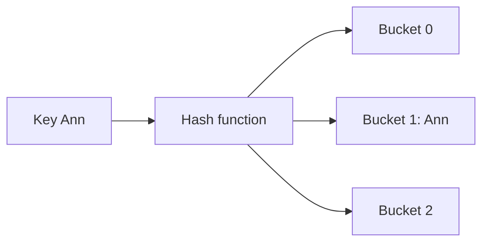

```csharp
var ages = new Dictionary<string, int>();
ages["Ann"] = 30;
ages["Bo"] = 41;
bool found = ages.TryGetValue("Ann", out int age);
```

Two keys can hash to the same bucket. That is a collision. A common fix is chaining: the bucket holds a small list of pairs. Open addressing is the other common fix: the table probes the next empty slot.

Average get, add, and remove are O(1). The worst case is O(n) if every key lands in one bucket. A good hash function and a load factor limit keep that rare. The load factor is the count divided by the bucket count. When it gets high, the table grows and rehashes.

Use a hash table when you look up by key. Do not use it when you need sorted order. A sorted dictionary or a tree keeps order. A hash table does not.

---

## 17. Graph

A graph is a set of nodes and a set of edges. A node is a point. An edge connects two nodes.

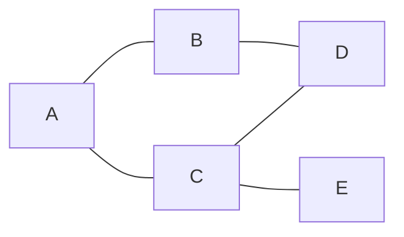

Words you need:

| Word | Meaning |
| --- | --- |
| Undirected | The edge works in both directions |
| Directed | The edge has one direction |
| Weighted | The edge has a cost, such as distance |
| Neighbor | A node connected by one edge |
| Path | A sequence of edges |
| Cycle | A path that returns to its start |

Use a graph for a map, a social network, or links between pages.

---

## 18. Adjacency matrix

An adjacency matrix is a table. Rows and columns are nodes. A 1 means "this edge exists". A 0 means "it does not".

```text
    A B C
A   0 1 1
B   1 0 0
C   1 0 0
```

Check one edge in O(1). Use O(n²) memory for n nodes, even if almost no edges exist. A weighted graph stores the weight instead of 1.

---

## 19. Adjacency list

An adjacency list stores, for each node, the list of neighbors.

```text
A: B, C
B: A
C: A
```

```csharp
var graph = new Dictionary<string, List<string>>
{
    ["A"] = new() { "B", "C" },
    ["B"] = new() { "A", "D" },
    ["C"] = new() { "A", "D", "E" },
    ["D"] = new() { "B", "C" },
    ["E"] = new() { "C" }
};
```

List the neighbors quickly. Use less memory when the graph is sparse. Sparse means few edges. A road map is sparse. "Everyone knows everyone" is dense.


| Job | Matrix | List |
| --- | --- | --- |
| Does edge A–B exist? | O(1) | O(degree of A) |
| List neighbors | O(n) | O(degree) |
| Memory | O(n²) | O(n + edges) |

Degree is the number of edges on one node. Prefer the list unless the graph is dense or you check edges constantly.

---

## 20. Depth-first search

Depth-first search (DFS) goes as far as it can on one path. Then it goes back and tries the next path. The natural tools are a stack, or recursion.

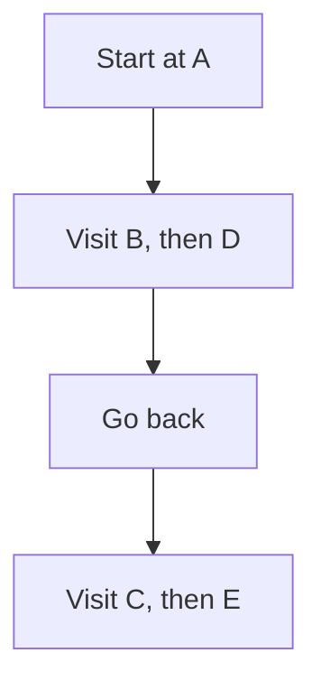

```csharp
static void Dfs(Dictionary<string, List<string>> graph, string start)
{
    var seen = new HashSet<string>();
    var stack = new Stack<string>();
    stack.Push(start);

    while (stack.Count > 0)
    {
        string node = stack.Pop();
        if (!seen.Add(node))
            continue;

        Console.WriteLine(node);
        foreach (string next in graph[node])
            stack.Push(next);
    }
}
```

`seen` stops a cycle from running forever. Use DFS to detect a cycle, to walk a maze, or to visit every node when the order of layers does not matter.

---

## 21. Breadth-first search

Breadth-first search (BFS) visits neighbors first, then neighbors of neighbors. The tool is a queue.

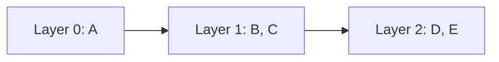

```csharp
static void Bfs(Dictionary<string, List<string>> graph, string start)
{
    var seen = new HashSet<string> { start };
    var queue = new Queue<string>();
    queue.Enqueue(start);

    while (queue.Count > 0)
    {
        string node = queue.Dequeue();
        Console.WriteLine(node);
        foreach (string next in graph[node])
        {
            if (seen.Add(next))
                queue.Enqueue(next);
        }
    }
}
```

On an unweighted graph, the first time BFS reaches a node, it has used the fewest edges. That is the shortest path by hop count. DFS does not give you that promise.

---

## 22. Tree

A tree is a graph with no cycle, and with one path between any two nodes. Class trees also pick a root.

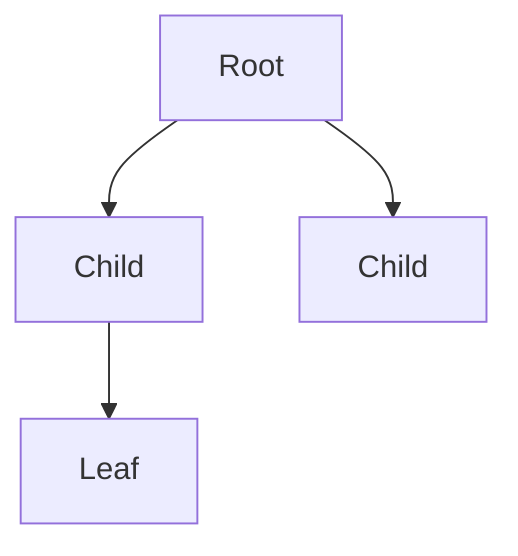

| Word | Meaning |
| --- | --- |
| Root | The top node. It has no parent |
| Parent | The node one step toward the root |
| Child | A node one step away from the root |
| Leaf | A node with no children |
| Height | The longest path from this node down to a leaf |

A file system is a tree. A family tree, in the simple form, is drawn as a tree.

---

## 23. Binary search tree

A binary tree gives each node at most two children: left and right.

A binary search tree (BST) adds a rule:

- The left subtree holds smaller keys.
- The right subtree holds larger keys.

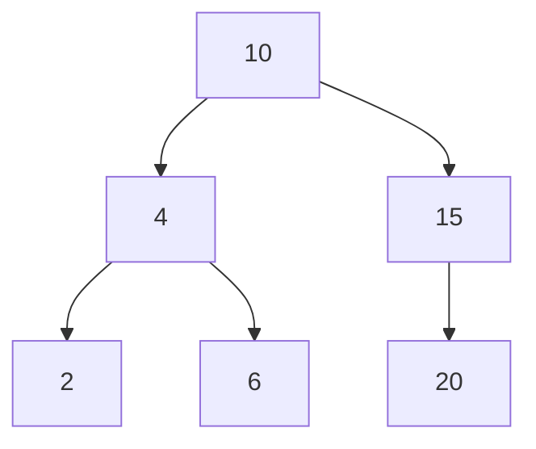

Search, insert, and delete follow that rule. If the tree is balanced, the cost is O(log n). If you insert sorted keys into a plain BST, the tree becomes a line, and the cost becomes O(n).

```csharp
sealed class Node
{
    public int Key { get; set; }
    public Node? Left { get; set; }
    public Node? Right { get; set; }
}

static Node Insert(Node? node, int key)
{
    if (node is null)
        return new Node { Key = key };
    if (key < node.Key)
        node.Left = Insert(node.Left, key);
    else if (key > node.Key)
        node.Right = Insert(node.Right, key);
    return node;
}
```

A balanced tree (AVL tree, red-black tree) repairs the shape after insert and delete. `SortedSet<T>` and `SortedDictionary<TKey, TValue>` are balanced. Use those in production. Write a plain BST to learn the rule.

---

## 24. Tree traversal

Traversal means "visit every node in one defined order".

| Order | Visit sequence | Useful for |
| --- | --- | --- |
| Pre-order | Node, left, right | Copy a tree, prefix form |
| In-order | Left, node, right | Sorted keys of a BST |
| Post-order | Left, right, node | Delete a tree, postfix form |

In-order on the tree above yields `2, 4, 6, 10, 15, 20`.

```csharp
static void InOrder(Node? node)
{
    if (node is null)
        return;
    InOrder(node.Left);
    Console.WriteLine(node.Key);
    InOrder(node.Right);
}
```

Level-order is different. It uses a queue and visits layer by layer. That is BFS on a tree.

---

## 25. Measure the time

Big O is the shape. A clock is the fact on your machine. Measure both when a choice matters.

```csharp
var watch = Stopwatch.StartNew();
InsertionSort(data);
watch.Stop();
Console.WriteLine(watch.Elapsed.TotalMilliseconds);
```

Rules for a fair check:

- Use the same data for each algorithm.
- Include a large n. A tiny array hides the shape.
- Run once to warm up, then measure. The first run pays extra costs.
- Do not compare a debug build with a release build.

The course uses the Java clock around the same idea: read the time, run the code, subtract.

---

## 26. Which one do I use?

| You need | Use |
| --- | --- |
| Undo, or Back | Stack |
| Fair waiting line | Queue |
| "Most urgent first" | Priority queue |
| Index read, add at end | `List<T>` |
| Many inserts at the front, no index read | Linked list |
| Lookup by key | `Dictionary<TKey, TValue>` |
| Sorted keys | `SortedSet<T>` or `SortedDictionary<,>` |
| Connections, paths | Graph, usually an adjacency list |
| Shortest path, unweighted | BFS |
| Visit all nodes, or detect a cycle | DFS |
| Sort large data | Library sort, which is O(n log n) |
| Find a value in sorted data | Binary search |

---

## 27. Words to search next

Stack, queue, priority queue, heap, linked list, dynamic array, capacity, Big O, linear search, binary search, interpolation search, bubble sort, selection sort, insertion sort, recursion, merge sort, quick sort, stable sort, hash table, collision, load factor, graph, adjacency matrix, adjacency list, DFS, BFS, tree, binary search tree, traversal, pre-order, in-order, post-order.

Not in this course, if you continue: heaps in detail, Dijkstra, balanced-tree rotations, trie, union-find.

---

## License note

The explanations and C# samples in this file are original study notes. The chapter order follows the Bro Code course. The course itself stays with its owner.
