# Data structures and algorithms, in plain language

A study guide in the chapter order of [Bro Code’s Data Structures and Algorithms course](https://www.youtube.com/watch?v=CBYHwZcbD-s), enriched with the ideas in Aditya Bhargava’s *Grokking Algorithms* and with the next structures that course names at the end: heaps, Dijkstra, balanced-tree rotations, tries, and union-find.

The examples are C#. C# types match the Java types in the course. A Go snippet appears for slices, because a slice is the Go dynamic array.

The sentences stay short on purpose:

- One idea in each sentence.
- Active voice.
- The same word for the same thing.
- A definition before the first technical use.

---

## How to read this

Read [Two words](#1-two-words) through [Linked list or array list?](#7-linked-list-or-array-list) first. Read [Big O](#8-big-o) before the search and sort sections. Use [Which structure?](#36-which-structure) when choosing a structure.

| Course time | Topic |
| --- | --- |
| 0:00 | [Two words](#1-two-words) |
| 0:02 | [Stack](#2-stack) |
| 0:11 | [Queue](#3-queue) |
| 0:21 | [Priority queue](#4-priority-queue) |
| 0:26 | [Linked list](#5-linked-list) |
| 0:40 | [Dynamic array](#6-dynamic-array) |
| 1:04 | [Linked list or array list?](#7-linked-list-or-array-list) |
| 1:13 | [Big O](#8-big-o) |
| 1:19 | [Linear search](#9-linear-search) |
| 1:23 | [Binary search](#10-binary-search) |
| 1:32 | [Interpolation search](#11-interpolation-search) |
| 1:41 | [Bubble sort](#12-bubble-sort) |
| 1:48 | [Selection sort](#13-selection-sort) |
| 1:56 | [Insertion sort](#14-insertion-sort) |
| 2:03 | [Recursion](#15-recursion) |
| 2:11 | [Merge sort](#16-merge-sort) |
| 2:25 | [Quick sort](#17-quick-sort) |
| 2:38 | [Hash table](#18-hash-table) |
| 2:52 | [Graph](#19-graph) |
| 2:57 | [Adjacency matrix](#20-adjacency-matrix) |
| 3:07 | [Adjacency list](#21-adjacency-list) |
| 3:15 | [Depth-first search](#22-depth-first-search) |
| 3:23 | [Breadth-first search](#23-breadth-first-search) |
| 3:30 | [Tree](#24-tree) |
| 3:33 | [Binary search tree](#25-binary-search-tree) |
| 3:53 | [Tree traversal](#26-tree-traversal) |
| 3:57 | [Measure the time](#27-measure-the-time) |
| — | [Heap](#28-heap) |
| — | [Dijkstra](#29-dijkstra) |
| — | [Balanced-tree rotations](#30-balanced-tree-rotations) |
| — | [Trie](#31-trie) |
| — | [Union-find](#32-union-find) |
| — | [Greedy algorithms](#33-greedy-algorithms) |
| — | [Dynamic programming](#34-dynamic-programming) |
| — | [K-nearest neighbors](#35-k-nearest-neighbors) |
| — | [Which structure?](#36-which-structure) |

Hash tables start at 2:38 in the course.

---

## 1. Two words

A **data structure** is a named place that stores data and keeps an order. A family tree is a structure. An array is a structure. Each structure has a different shape, so each structure makes some jobs cheap and other jobs costly.

An **algorithm** is a list of steps that solves one problem. A pizza recipe is an algorithm: heat the oven, shape the dough, add the toppings, bake. The problem is hunger. The steps are the solution.

Two reasons to learn both:

1. The program uses less time and less memory.
2. Interviews ask these questions. "Reverse a linked list" is a common one.

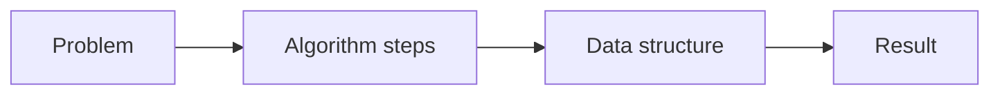

---

## 2. Stack

A stack is a last-in, first-out structure. The short name is LIFO.

Picture a stack of books. A book goes on top. A book comes off the top. A book does not come out of the middle.


| Name | What it does |
| --- | --- |
| Push | Add an item on top |
| Pop | Remove the top item and return it |
| Peek | Read the top item, and leave it there |
| IsEmpty | Tell whether the stack has no items |
| Search | Look for an item |

```csharp
var books = new Stack<string>();
books.Push("A");
books.Push("B");
books.Push("C");

string topItem = books.Peek(); // "C"
string last = books.Pop();     // "C"
bool none = books.Count == 0;
```

A stack fits an undo button, a browser Back button, and the call stack. The call stack remembers which method called which method. [Recursion](#15-recursion) uses that same stack.

A stack is the wrong tool when the oldest item must leave first. That job belongs to a [queue](#3-queue).

---

## 3. Queue

A queue is a first-in, first-out structure. The short name is FIFO.

Picture a line for concert tickets. The first person in line buys a ticket first. A new person joins at the back.

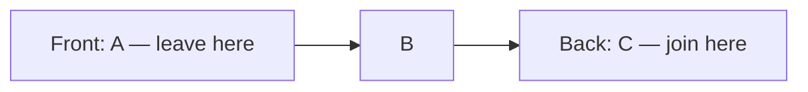

| Name | C# method | What it does |
| --- | --- | --- |
| Enqueue | `Enqueue` | Add at the back |
| Dequeue | `Dequeue` | Remove from the front |
| Peek | `Peek` | Read the front item |

```csharp
var line = new Queue<string>();
line.Enqueue("Ada");
line.Enqueue("Lin");
string next = line.Dequeue(); // "Ada"
```

A queue fits a print queue, a keyboard buffer, and a job list. A buffer holds data until the program can process it. [Breadth-first search](#23-breadth-first-search) uses a queue.

---

## 4. Priority queue

A priority queue does not use arrival time. Each item has a priority. The item with the best priority leaves first.

Picture a hospital. A heart attack does not wait behind a small cut.

In .NET, a smaller priority number leaves first.

```csharp
var er = new PriorityQueue<string, int>();
er.Enqueue("small cut", 3);
er.Enqueue("heart attack", 1);
er.Enqueue("broken arm", 2);

string next = er.Dequeue(); // "heart attack"
```

The usual inner structure is a [heap](#28-heap). Insert and remove are about O(log n), not O(1). [Big O](#8-big-o) defines that notation.

A priority queue fits task order, emergency order, and [Dijkstra](#29-dijkstra).

---

## 5. Linked list

A linked list is a chain of nodes. A node holds a value and a link to the next node.

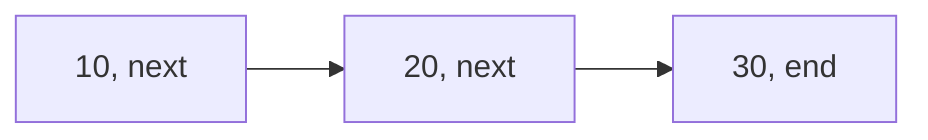

The first node is the head. The last node points to nothing. In C# that "nothing" is `null`.

A singly linked list has one direction: next. A doubly linked list also has a link to the previous node. The extra link makes "go back" cheap. It also uses more memory.

`LinkedList<T>` in C# is doubly linked.

```csharp
var list = new LinkedList<int>();
list.AddLast(10);
list.AddLast(20);
list.AddFirst(5);   // head becomes 5
list.Remove(20);
```

Insert or delete at the head does not move the other items. There is no single block of memory. Each node can sit anywhere. Item 500 is not a jump: the walk starts at the head. That walk costs more as the list grows. The cost names are in [Big O](#8-big-o).

A Go list is usually a slice, not a node chain. See [Dynamic array](#6-dynamic-array).

---

## 6. Dynamic array

A normal array has a fixed size. The size is chosen at creation. An array of five cannot hold a sixth item.

A dynamic array grows. C# calls it `List<T>`. Java calls it `ArrayList`. Go calls it a slice.

The list keeps a hidden array with extra empty slots. That hidden size is the **capacity**. The number of real items is the **count**.

Start with capacity 4 and count 0. Four slots exist. None of them hold an item yet.

| Add | Item | Count after | Capacity after | What happens |
| --- | --- | --- | --- | --- |
| 1 | Ann | 1 | 4 | Write into an empty slot. No copy. |
| 2 | Bo | 2 | 4 | Write into an empty slot. No copy. |
| 3 | Cy | 3 | 4 | Write into an empty slot. No copy. One slot is still free. |
| 4 | Di | 4 | 4 | Write into the last free slot. No copy. The hidden array is now full. |
| 5 | Ed | 5 | 8 | No free slot. Allocate a new array of 8. Copy Ann, Bo, Cy, and Di. Then write Ed. |

The fifth add is the costly one. Four items move to a new block, then the new item is written. Count is 5. Capacity is 8. Three slots are free again.

The next copy does not happen on the sixth, seventh, or eighth add. Those three adds only fill free slots. The copy happens again on the ninth add, when capacity grows from 8 to 16.

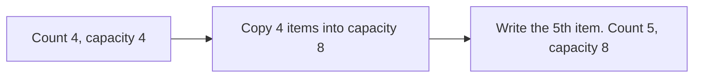

So "most adds are cheap" means this: adds 1–4 do not copy, adds 6–8 do not copy, and only the add that finds a full array copies. The copy is rare because the gap doubles each time: full at 4, then 8, then 16, then 32.

"The average add is still cheap" means this: add up the cost of many adds, then divide by the number of adds. The copies are large, but they are few. Across 16 adds there are only a few copies, so the cost per add stays flat. That average is the amortized cost. One unlucky add is O(n). The average add is O(1). [Big O](#8-big-o) names those shapes.

```csharp
var names = new List<string>(capacity: 4);
names.Add("Ann");
names.Add("Bo");
names.Add("Cy");
names.Add("Di");          // count 4, capacity 4
names.Add("Ed");          // copy, then count 5, capacity 8
Console.WriteLine(names[0]);
names.Insert(0, "Cy");    // shifts later items right
```

`Insert` at the front is a different cost. Every later item shifts one place right. That shift grows with the count. It is not the rare capacity copy.

Go grows a slice the same way:

```go
names := make([]string, 0, 4) // length 0, capacity 4
names = append(names, "Ann", "Bo", "Cy", "Di")
names = append(names, "Ed")   // may copy into a larger array
```

---

## 7. Linked list or array list?

The shape of the job decides. Habit does not.

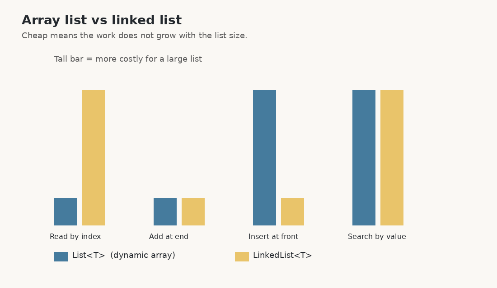

| Job | `List<T>` | `LinkedList<T>` |
| --- | --- | --- |
| Read item at index i | Cheap | Costly. The walk is i steps |
| Add at the end | Cheap on average | Cheap if the tail is kept |
| Insert at the front | Costly. Items shift | Cheap |
| Search by value | Costly | Costly |
| Memory | One block, good for the CPU cache | Extra link fields, nodes can be scattered |
| Extra space | Some empty slots | One or two links per node |

An array list is the default. A linked list wins when inserts or deletes happen at the ends often, and index access is not needed.

The CPU cache is the processor's fast local memory. The processor reads nearby memory quickly. An array keeps items together. A linked list does not. *Grokking Algorithms* makes the same point: an array is better for reads, a list is better for inserts in the middle once the node is already in hand.

---

## 8. Big O

Big O describes how the work grows when the input grows. It is not the time in milliseconds. It is the shape of the growth.

The usual talk is about the worst common case. Constant factors drop. `3n + 10` is O(n). The `3` and the `10` do not change the shape.

| Name | Plain meaning | Example |
| --- | --- | --- |
| O(1) | The work stays flat | Read `list[i]`, stack push |
| O(log n) | The work grows very slowly | [Binary search](#10-binary-search) |
| O(n) | The work grows in a straight line | [Linear search](#9-linear-search) |
| O(n log n) | A bit more than a straight line | [Merge sort](#16-merge-sort), [quick sort](#17-quick-sort) on average |
| O(n²) | The work grows with pairs | [Bubble sort](#12-bubble-sort) |

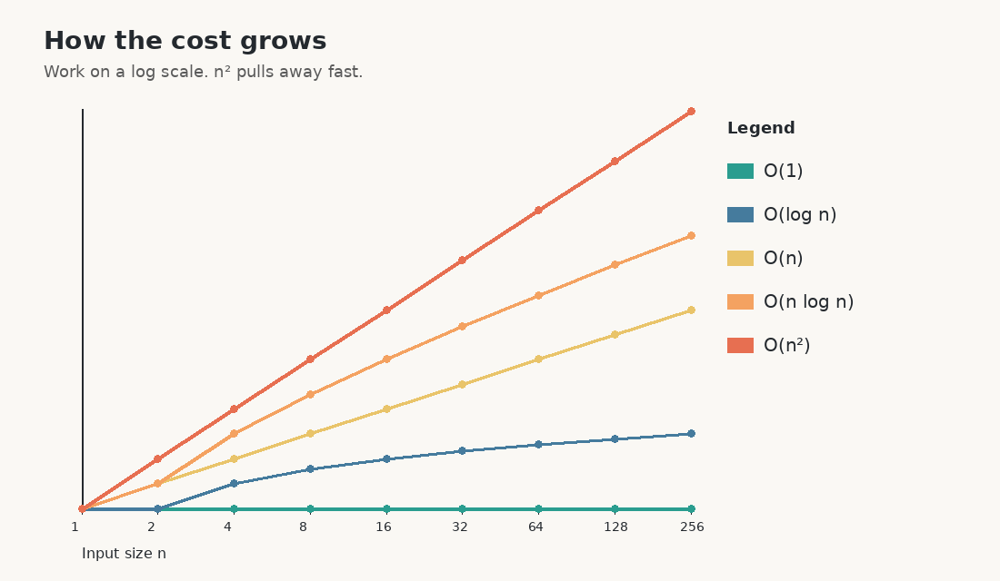

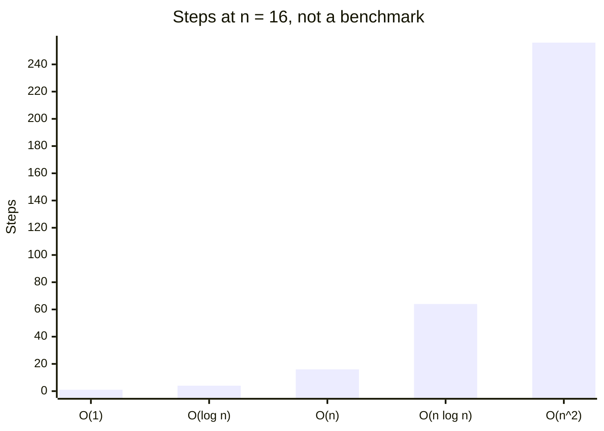

A method can have more than one cost. Insert into a [dynamic array](#6-dynamic-array) is O(1) on average and O(n) on the rare copy. Name the case.

*Grokking Algorithms* uses a simple test: if the input doubles, does the work stay flat, grow a little, double, or square? That test identifies the row in the table above.

---

## 9. Linear search

Linear search checks each item until it finds the target, or until the data ends.

```csharp
static int LinearSearch(int[] data, int target)
{
    for (int i = 0; i < data.Length; i++)
    {
        if (data[i] == target)
            return i;
    }
    return -1;
}
```

The cost is O(n). It fits small data or unsorted data. Sorting first can cost more than one scan.

---

## 10. Binary search

Binary search needs sorted data. It looks at the middle item. If the target is smaller, it ignores the right half. If the target is larger, it ignores the left half. It repeats.

A million sorted items take at most about 20 steps. One million is cut in half about 20 times before one item remains. That is the log₂(n) fact from *Grokking Algorithms*. A linear scan of the same million items can take a million steps.

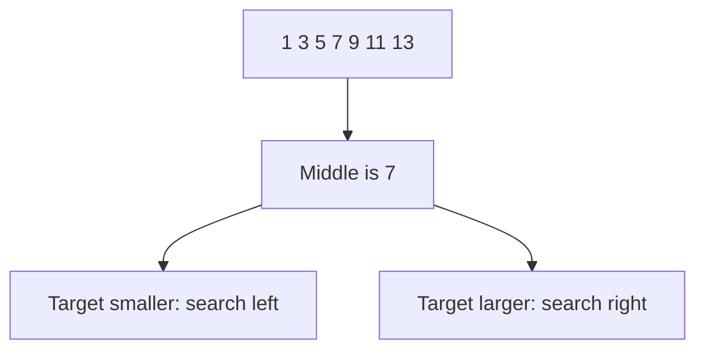

```csharp
static int BinarySearch(int[] data, int target)
{
    int low = 0;
    int high = data.Length - 1;
    while (low <= high)
    {
        int mid = low + (high - low) / 2;
        if (data[mid] == target)
            return mid;
        if (data[mid] < target)
            low = mid + 1;
        else
            high = mid - 1;
    }
    return -1;
}
```

The cost is O(log n). `low + (high - low) / 2` avoids an overflow that `(low + high) / 2` can cause on large indexes.

C# also has `Array.BinarySearch`. The data must already be sorted. Binary search on unsorted data returns a wrong answer, not a slow answer.

---

## 11. Interpolation search

Interpolation search is binary search with a guess. Binary search always picks the middle. Interpolation search estimates where the value should sit. A person who looks up a name that starts with S opens a phone book nearer to S than to the middle.

The position estimate is:

```text
low + (target - data[low]) * (high - low) / (data[high] - data[low])
```

It is fast when the values are sorted and spread evenly. The average cost can be about O(log log n). The worst cost is O(n) if the values are clustered. Unsorted data is invalid input. Binary search is the safer default.

---

## 12. Bubble sort

Bubble sort compares neighbors. If they are out of order, it swaps them. It repeats until a pass makes no swap.

```text
5 1 4 2
1 5 4 2
1 4 5 2
1 4 2 5
```

The large values move to the end. The cost is O(n²). It is fine for a teaching example and for tiny data. It is the wrong default for large data.

---

## 13. Selection sort

Selection sort finds the smallest item and swaps it into position 0. It finds the smallest of the rest and swaps it into position 1. It repeats.

Selection sort does few swaps. It still looks at almost every pair, so it is still O(n²). *Grokking Algorithms* starts with this sort because the steps are easy to see: find the next minimum, put it in place.

---

## 14. Insertion sort

Insertion sort keeps a sorted part on the left. It takes the next item and inserts that item into the correct place in the sorted part.

The worst cost is still O(n²). The sort is fast when the data is already almost sorted, because each item only moves a short distance.

```csharp
static void InsertionSort(int[] data)
{
    for (int i = 1; i < data.Length; i++)
    {
        int current = data[i];
        int j = i - 1;
        while (j >= 0 && data[j] > current)
        {
            data[j + 1] = data[j];
            j--;
        }
        data[j + 1] = current;
    }
}
```

---

## 15. Recursion

A recursive method calls itself. It needs a base case. The base case is the stop condition. Without it, the method calls itself until the call stack overflows.

*Grokking Algorithms* splits a recursive function into two parts: the base case, and the recursive case that moves toward that base case. Both parts are required.

```csharp
static int Factorial(int n)
{
    if (n <= 1)
        return 1;                 // base case
    return n * Factorial(n - 1);  // smaller problem
}
```

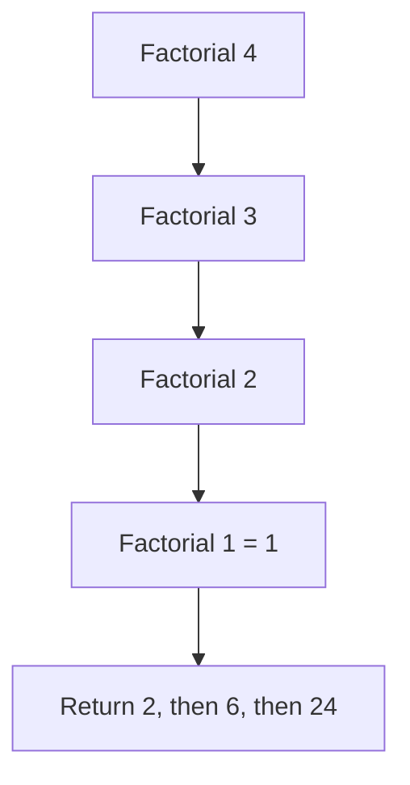

Each call waits on the [stack](#2-stack) until the smaller call returns. That is why a deep recursion can run out of stack space even when the answer is simple.

Recursion fits a problem that has the same shape at a smaller size: a folder tree, a divide-and-conquer sort, a graph walk. A loop fits a counter. A loop uses less stack space.

Divide and conquer, the pattern behind [merge sort](#16-merge-sort) and [quick sort](#17-quick-sort), has three parts:

1. A base case, usually one item or zero items.
2. A split into smaller problems.
3. A combine step that builds the answer.

---

## 16. Merge sort

Merge sort is divide and conquer.

1. Split the data into two halves.
2. Sort each half. This is the recursive call.
3. Merge the two sorted halves into one sorted result.

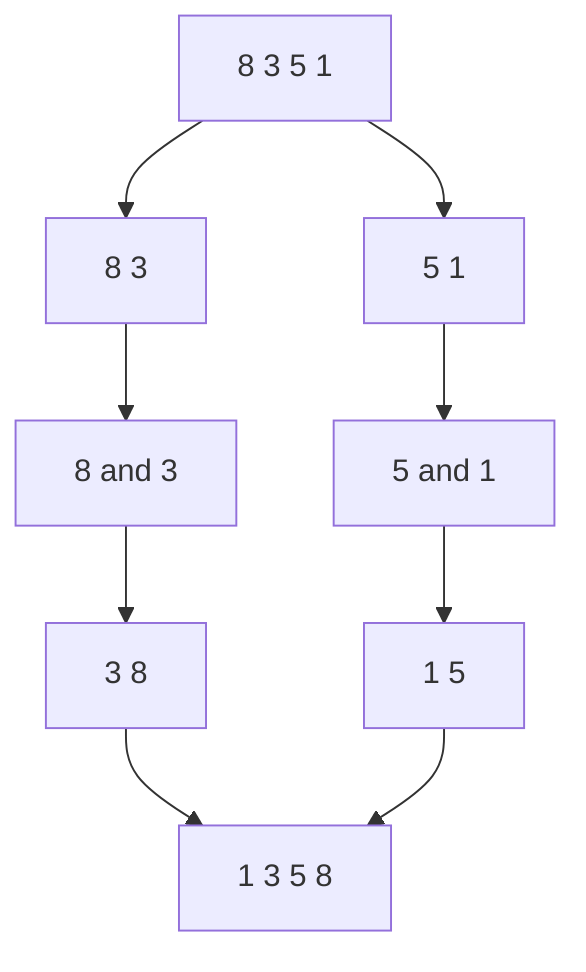

The cost is O(n log n) in the best, average, and worst case. It is stable: equal items keep their original order. It needs extra memory for the merge. That is the trade.

---

## 17. Quick sort

Quick sort picks a pivot. It partitions the data. Items smaller than the pivot go left. Items larger than the pivot go right. It then sorts the two sides.

```text
Data:  5 2 9 1 7     pivot = 5
After: 2 1  5  9 7
       left   right
```

Average cost is O(n log n). Worst cost is O(n²) if the pivot is always the smallest or largest item. A random pivot, or a median-of-three pivot, makes the worst case rare. Quick sort uses little extra memory. It is often faster than merge sort in practice because it moves items inside the same array. It is not stable.

*Grokking Algorithms* uses quick sort to show divide and conquer: the partition is the divide, the two recursive calls do the work, and no extra merge array is required. The pivot choice is the whole performance story.

In production C#, `Array.Sort` is the right call. The library sort is tuned. A hand-written quick sort is for learning.

---

## 18. Hash table

A hash table stores a value under a key. C# calls it `Dictionary<TKey, TValue>`. Java calls it `HashMap`. Go calls it a map.

A hash function turns the key into a number. That number picks a bucket. A bucket is a slot in the hidden array.

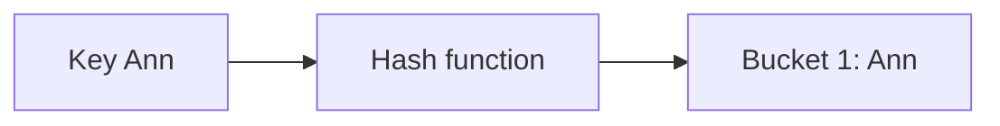

```csharp
var ages = new Dictionary<string, int>();
ages["Ann"] = 30;
ages["Bo"] = 41;
bool found = ages.TryGetValue("Ann", out int age);
```

### Two keys, one bucket

Suppose the table has 10 buckets, and the bucket is `key % 10`.

- Key 12 goes to bucket 2, because `12 % 10 = 2`.
- Key 22 also goes to bucket 2, because `22 % 10 = 2`.

Both keys are valid. They are not equal. They only share a bucket. That shared bucket is a **collision**.

A collision is not a failed insert. It means the bucket must hold more than one pair, or the second key must look for another slot.

**Chaining** puts a small list in the bucket.

```text
Bucket 2: (12, "cat") -> (22, "dog")
```

Lookup hashes to bucket 2, then walks that short list until the key matches. If the lists stay short, the walk is cheap.

**Open addressing** does not store a list. If bucket 2 is full, the insert probes the next slot.

```text
12 lands in bucket 2
22 sees that bucket 2 is full
22 probes bucket 3 and lands there
```

Lookup of 22 must repeat the same probe sequence. A deleted slot needs a tombstone, or a later probe will stop too early and miss a key.

Average get, add, and remove are O(1). The worst case is O(n) if every key lands in one bucket. A good hash function and a load factor limit keep that rare. The load factor is the count divided by the bucket count. When it gets high, the table grows and rehashes. Rehash means every key is placed again in a larger bucket array.

*Grokking Algorithms* uses hash tables for three jobs: a cache, a lookup such as a phone book, and a duplicate check such as "has this person already voted?". Those jobs are all "given this key, get the value."

A hash table does not keep sorted order. A [binary search tree](#25-binary-search-tree) or `SortedDictionary<TKey, TValue>` keeps order.

---

## 19. Graph

A graph is a set of nodes and a set of edges. A node is a point. An edge connects two nodes.

This graph is the example for the next sections:

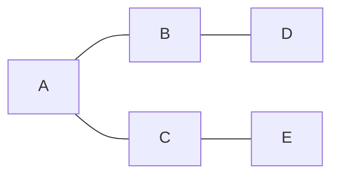

Edges: A–B, A–C, B–D, C–E. There is no edge from B to C.

| Word | Meaning |
| --- | --- |
| Undirected | The edge works in both directions |
| Directed | The edge has one direction |
| Weighted | The edge has a cost, such as distance |
| Neighbor | A node connected by one edge |
| Path | A sequence of edges |
| Cycle | A path that returns to its start |

A graph fits a map, a social network, or links between pages.

---

## 20. Adjacency matrix

An adjacency matrix is a table. Rows and columns are nodes. A 1 means "this edge exists". A 0 means "it does not".

For the graph in [Graph](#19-graph):

```text
    A B C D E
A   0 1 1 0 0
B   1 0 0 1 0
C   1 0 0 0 1
D   0 1 0 0 0
E   0 0 1 0 0
```

One edge check is O(1). Memory is O(n²) for n nodes, even if almost no edges exist. A weighted graph stores the weight instead of 1.

---

## 21. Adjacency list

An adjacency list stores, for each node, the list of neighbors.

```text
A: B, C
B: A, D
C: A, E
D: B
E: C
```

```csharp
var graph = new Dictionary<string, List<string>>
{
    ["A"] = new() { "B", "C" },
    ["B"] = new() { "A", "D" },
    ["C"] = new() { "A", "E" },
    ["D"] = new() { "B" },
    ["E"] = new() { "C" }
};
```

Neighbors are listed quickly. Memory stays small when the graph is sparse. Sparse means few edges. A road map is sparse. "Everyone knows everyone" is dense.

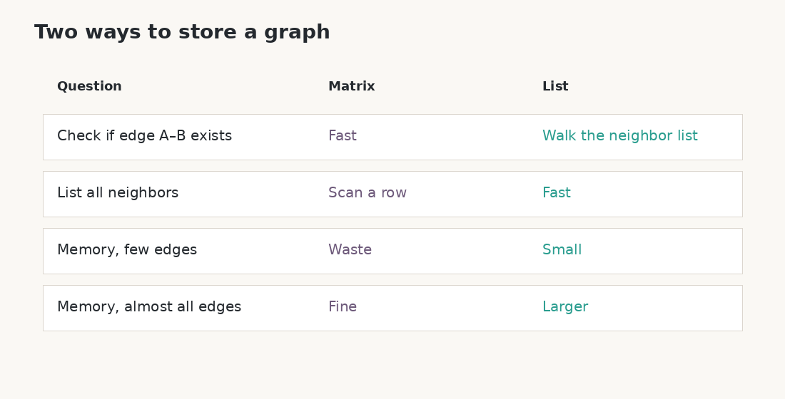

| Job | Matrix | List |
| --- | --- | --- |
| Does edge A–B exist? | O(1) | O(degree of A) |
| List neighbors | O(n) | O(degree) |
| Memory | O(n²) | O(n + edges) |

Degree is the number of edges on one node. The list is the default unless the graph is dense or edge checks are constant.

---

## 22. Depth-first search

Depth-first search (DFS) walks the graph from [Graph](#19-graph). The start node is A. The neighbors of A are B and C. The neighbor of B is D. The neighbor of C is E.

DFS goes as far as it can on one path. Then it goes back and tries the next path. The tools are a stack, or recursion.

One possible walk, if B is pushed after C and the stack pops B first:

```text
Start A
Go to B, then to D
D has no new neighbor
Go back to A
Go to C, then to E
```

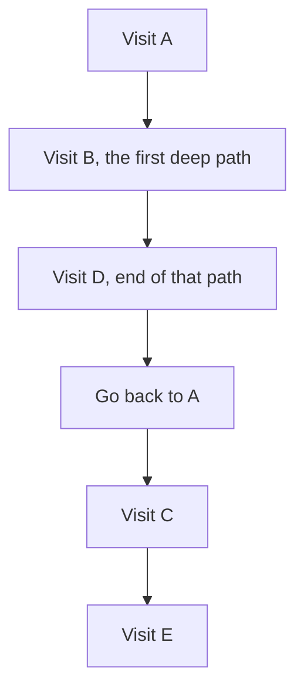

The diagram is that walk, not a new graph. The graph is the one in [Graph](#19-graph).

```csharp
static void Dfs(Dictionary<string, List<string>> graph, string start)
{
    var seen = new HashSet<string>();
    var stack = new Stack<string>();
    stack.Push(start);

    while (stack.Count > 0)
    {
        string node = stack.Pop();
        if (!seen.Add(node))
            continue;

        Console.WriteLine(node);
        foreach (string next in graph[node])
            stack.Push(next);
    }
}
```

`seen` stops a cycle from running forever. DFS fits cycle detection, a maze, and "visit every node" when layer order does not matter.

---

## 23. Breadth-first search

Breadth-first search (BFS) visits neighbors first, then neighbors of neighbors. The tool is a [queue](#3-queue).

On the same graph:

```text
Layer 0: A
Layer 1: B, C
Layer 2: D, E
```

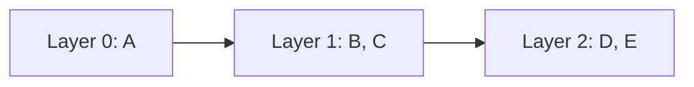

```csharp
static void Bfs(Dictionary<string, List<string>> graph, string start)
{
    var seen = new HashSet<string> { start };
    var queue = new Queue<string>();
    queue.Enqueue(start);

    while (queue.Count > 0)
    {
        string node = queue.Dequeue();
        Console.WriteLine(node);
        foreach (string next in graph[node])
        {
            if (seen.Add(next))
                queue.Enqueue(next);
        }
    }
}
```

On an unweighted graph, the first time BFS reaches a node, it has used the fewest edges. That is the shortest path by hop count. DFS does not give that promise.

*Grokking Algorithms* uses BFS for "who is the closest person with a given property?" The queue spreads one friendship hop at a time. The first match is the closest match. The same idea finds the fewest road segments when every road counts as one hop. Weighted roads need [Dijkstra](#29-dijkstra), not BFS.

---

## 24. Tree

A tree is a graph with no cycle, and with one path between any two nodes. Class trees also pick a root.

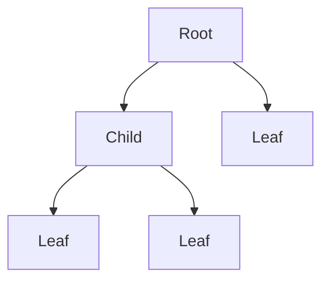

Root has two nodes under it: Child and Leaf. Child has two leaves. Leaf has no nodes under it, so Leaf is a leaf. The picture has one internal child and three leaves.

| Word | Meaning |
| --- | --- |
| Root | The top node. It has no parent |
| Parent | The node one step toward the root |
| Child | A node one step away from the root |
| Leaf | A node with no children |
| Height | The longest path from this node down to a leaf |

A file system is a tree. A simple family tree is drawn as a tree.

---

## 25. Binary search tree

A binary tree gives each node at most two children: left and right.

A binary search tree (BST) adds a rule:

- The left subtree holds smaller keys.
- The right subtree holds larger keys.

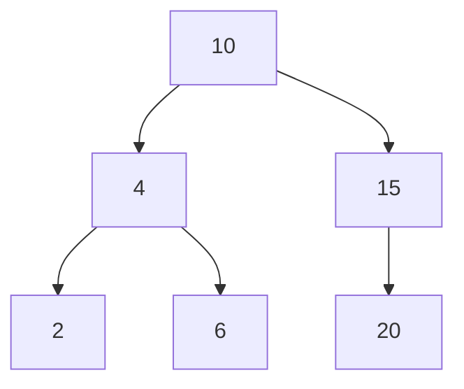

Search, insert, and delete follow that rule. If the tree is balanced, the cost is O(log n). If sorted keys go into a plain BST, the tree becomes a line, and the cost becomes O(n). [Rotations](#30-balanced-tree-rotations) repair that shape.

```csharp
sealed class Node
{
    public int Key { get; set; }
    public Node? Left { get; set; }
    public Node? Right { get; set; }
}

static Node Insert(Node? node, int key)
{
    if (node is null)
        return new Node { Key = key };
    if (key < node.Key)
        node.Left = Insert(node.Left, key);
    else if (key > node.Key)
        node.Right = Insert(node.Right, key);
    return node;
}
```

`SortedSet<T>` and `SortedDictionary<TKey, TValue>` are balanced. Those are the production types. A plain BST is for learning the rule.

---

## 26. Tree traversal

Traversal means "visit every node in one defined order".

| Order | Visit sequence | Useful for |
| --- | --- | --- |
| Pre-order | Node, left, right | Copy a tree, prefix form |
| In-order | Left, node, right | Sorted keys of a BST |
| Post-order | Left, right, node | Delete a tree, postfix form |

In-order on the tree in [Binary search tree](#25-binary-search-tree) yields `2, 4, 6, 10, 15, 20`.

```csharp
static void InOrder(Node? node)
{
    if (node is null)
        return;
    InOrder(node.Left);
    Console.WriteLine(node.Key);
    InOrder(node.Right);
}
```

Level-order is different. It uses a queue and visits layer by layer. That is BFS on a tree.

---

## 27. Measure the time

Big O is the shape. A clock is the fact on one machine. Measure both when a choice matters.

```csharp
var watch = Stopwatch.StartNew();
InsertionSort(data);
watch.Stop();
Console.WriteLine(watch.Elapsed.TotalMilliseconds);
```

A fair check uses the same data for each algorithm, a large n, a warm-up run, and the same build type. A tiny array hides the shape. The first run pays extra costs. A debug build is not comparable to a release build.

The course reads a clock, runs the code, and subtracts. The idea is the same.

---

## 28. Heap

A heap is a complete binary tree with a heap rule. Complete means every level is full except possibly the last, and the last level fills from the left.

A min-heap says: every parent is less than or equal to its children. The smallest item is the root. A max-heap says the opposite. The largest item is the root.

A [priority queue](#4-priority-queue) is usually a heap.

The tree can live in an array. For a node at index `i`:

- Left child is `2i + 1`
- Right child is `2i + 2`
- Parent is `(i - 1) / 2`

```text
Tree:          Array:
      1        [1, 3, 2, 7, 4]
     / \
    3   2
   / \
  7   4
```

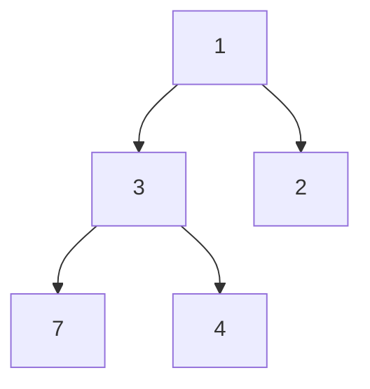

**Insert:** put the item in the next free slot at the end. Then bubble it up while it is smaller than its parent. The cost is O(log n) because the height is about log n.

**Extract min:** read the root. Move the last item to the root. Bubble that item down. Swap it with the smaller child until the heap rule holds. The cost is O(log n).

**Heapify:** start at the last parent and bubble down toward the root. An unordered array becomes a heap in O(n).

**Heap sort:** build a max-heap, then extract the max into the end of the array, again and again. The cost is O(n log n). It uses little extra memory. It is not stable.

```csharp
var heap = new PriorityQueue<string, int>();
heap.Enqueue("task-c", 3);
heap.Enqueue("task-a", 1);
heap.Enqueue("task-b", 2);
string first = heap.Dequeue(); // "task-a"
```

---

## 29. Dijkstra

Dijkstra finds the cheapest path in a weighted graph with no negative weights. BFS is not enough here. BFS counts hops. Dijkstra counts weight.

```text
A --1--> B --4--> D
A --5--> C --1--> D
```

The hop path A–C–D has 2 edges. The cheap path is A–B–D, cost 5. A–C–D costs 6.

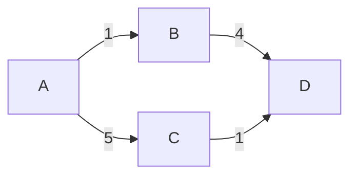

The algorithm:

1. Set the start distance to 0. Set every other distance to infinity.
2. Put the nodes in a min-heap, ordered by current distance.
3. Take the unsettled node with the smallest distance.
4. For each neighbor, try a shorter path. If `distance[node] + weight` is smaller than `distance[neighbor]`, update the neighbor and record the previous node. That update is relaxation.
5. Repeat until the target is settled, or the heap is empty.

A settled node already has its cheapest distance. That claim is true only when no edge weight is negative. A negative edge can make a later path cheaper. Bellman-Ford handles negative edges. Dijkstra does not.

```csharp
static Dictionary<string, int> Dijkstra(
    Dictionary<string, List<(string To, int Weight)>> graph,
    string start)
{
    var dist = graph.Keys.ToDictionary(k => k, _ => int.MaxValue);
    dist[start] = 0;
    var heap = new PriorityQueue<string, int>();
    heap.Enqueue(start, 0);

    while (heap.Count > 0)
    {
        string node = heap.Dequeue();
        foreach (var (to, weight) in graph[node])
        {
            if (dist[node] == int.MaxValue)
                continue;
            int next = dist[node] + weight;
            if (next < dist[to])
            {
                dist[to] = next;
                heap.Enqueue(to, next);
            }
        }
    }
    return dist;
}
```

This version may push the same node more than once. The first time a node is dequeued with its best known distance, later worse copies can be ignored. The common cost with a heap is about O((V + E) log V).

---

## 30. Balanced-tree rotations

A plain [BST](#25-binary-search-tree) becomes a line if keys arrive sorted. Search then costs O(n). A balanced tree keeps the height near log n.

A rotation changes the shape and keeps the search rule.

Right rotation, used when the left side is too tall:

```text
      30                20
     /                 /  \
   20        -->     10   30
   /
 10
```

Left rotation is the mirror. The right child becomes the parent.

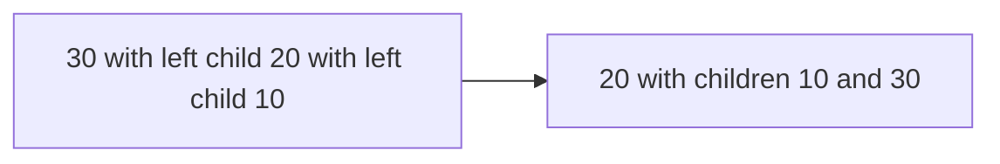

AVL trees use a balance factor: height of the left subtree minus height of the right subtree. A legal node has a balance factor of -1, 0, or 1. After an insert, the first unbalanced ancestor is repaired:

| Case | Shape | Repair |
| --- | --- | --- |
| LL | Insert in the left child's left | One right rotation |
| RR | Insert in the right child's right | One left rotation |
| LR | Insert in the left child's right | Left rotation, then right rotation |
| RL | Insert in the right child's left | Right rotation, then left rotation |

Red-black trees keep balance with color rules instead of a height number. Each insert or delete still uses a few rotations. `SortedSet<T>` is a red-black tree. The caller does not rotate. The tree does.

---

## 31. Trie

A trie is a tree of characters. Each edge is one character. A word is a path from the root. Nodes that end a word are marked.

```text
cat, car, dog

root
 ├─ c
 │   └─ a
 │       ├─ t  (end)
 │       └─ r  (end)
 └─ d
     └─ o
         └─ g  (end)
```

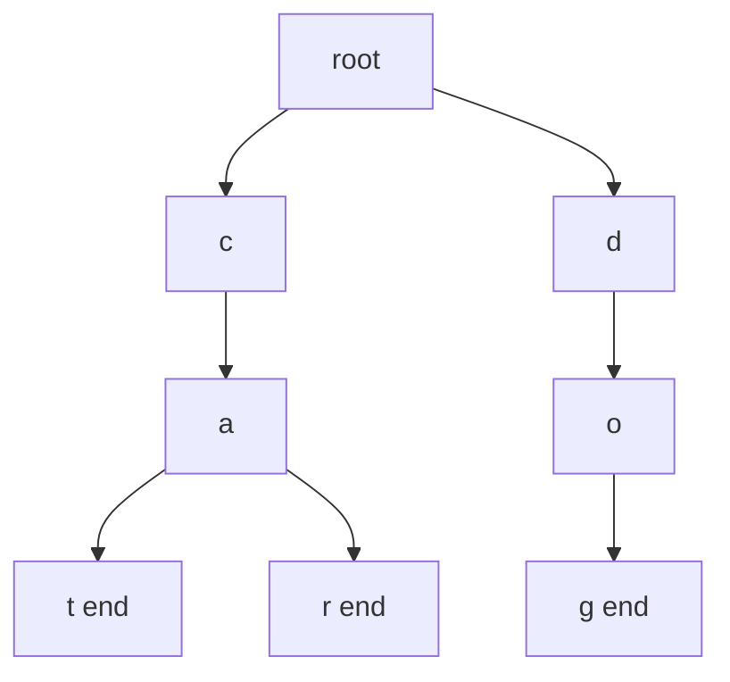

Search and insert cost O(length of the word), not O(number of words). A prefix query lists every word that starts with those characters. That is the autocomplete job.

A trie uses more memory than a hash table when many prefixes are not shared. It wins when the job is "starts with", not "exact key".

```csharp
sealed class TrieNode
{
    public Dictionary<char, TrieNode> Next { get; } = new();
    public bool IsWord { get; set; }
}

static void Insert(TrieNode root, string word)
{
    var node = root;
    foreach (char ch in word)
    {
        if (!node.Next.TryGetValue(ch, out var child))
        {
            child = new TrieNode();
            node.Next[ch] = child;
        }
        node = child;
    }
    node.IsWord = true;
}
```

---

## 32. Union-find

Union-find tracks disjoint sets. Disjoint means the sets do not share an item. Two operations matter:

- `Find(x)` returns the set that holds x.
- `Union(x, y)` joins the two sets.

The structure is a parent pointer per item. The root is its own parent. `Find` follows parents to the root.

```text
1 and 2 are connected. 3 is alone.

1 <- 2     3
```

**Union by rank** hangs the shorter tree under the taller tree. The trees stay short.

**Path compression** makes every node on a find path point straight at the root. The next find is almost flat.

Together, the cost of one operation is almost O(1). The formal name is inverse Ackermann, which grows slower than log n for every practical n.

```csharp
sealed class UnionFind
{
    private readonly int[] parent;
    private readonly int[] rank;

    public UnionFind(int n)
    {
        parent = Enumerable.Range(0, n).ToArray();
        rank = new int[n];
    }

    public int Find(int x)
    {
        if (parent[x] != x)
            parent[x] = Find(parent[x]);
        return parent[x];
    }

    public void Union(int a, int b)
    {
        int ra = Find(a);
        int rb = Find(b);
        if (ra == rb)
            return;
        if (rank[ra] < rank[rb])
            parent[ra] = rb;
        else if (rank[ra] > rank[rb])
            parent[rb] = ra;
        else
        {
            parent[rb] = ra;
            rank[ra]++;
        }
    }
}
```

Union-find fits connected components, "are these two nodes already connected?", and Kruskal's minimum spanning tree. A new edge that joins two nodes with the same root would create a cycle.

---

## 33. Greedy algorithms

A greedy algorithm takes the best local step and does not take it back. It is fast. It is correct only when a local best step cannot block a global best answer.

A classroom example: pick the meeting that ends first, then pick the next meeting that starts after that end. That greedy rule packs the most meetings into one room. The proof is that any better schedule can be swapped into this one.

A set-cover example: pick the station that adds the most new cities, then repeat. That rule is a heuristic. It may not pick the smallest set of stations. *Grokking Algorithms* uses this to show an approximation: the answer is good, and it is not always optimal. Name that difference. A greedy step is not a proof.

Dijkstra is greedy in the same family: always expand the cheapest unsettled node. The no-negative-weight rule is what makes that local choice safe.

---

## 34. Dynamic programming

Dynamic programming solves a problem by solving smaller versions of the same problem and storing the answers. Recursion without storage can recompute the same subproblem many times.

The knapsack question: a bag holds 4 kg. Items are a 1 kg phone worth 1500, a 3 kg laptop worth 2000, and a 4 kg camera worth 3000. Which subset fits and has the highest value?

A table cell `dp[i, w]` is the best value using the first `i` items with capacity `w`.

| Items used | Cap 0 | Cap 1 | Cap 2 | Cap 3 | Cap 4 |
| --- | --- | --- | --- | --- | --- |
| none | 0 | 0 | 0 | 0 | 0 |
| phone 1 kg / 1500 | 0 | 1500 | 1500 | 1500 | 1500 |
| plus laptop 3 kg / 2000 | 0 | 1500 | 1500 | 2000 | 3500 |
| plus camera 4 kg / 3000 | 0 | 1500 | 1500 | 2000 | 3500 |

The camera alone is 3000. The phone plus the laptop is 3500 and still fits. The answer is 3500.

Each cell looks at two choices: skip the item, or take it if it fits and add the stored answer for the remaining capacity. The cost is O(items × capacity). That is why the technique fits a small integer capacity and fails when the capacity is huge.

Fibonacci is the small version of the same idea. `Fib(n) = Fib(n - 1) + Fib(n - 2)` recomputes the same calls. A table, or two variables, stores each answer once.

---

## 35. K-nearest neighbors

K-nearest neighbors (KNN) classifies a new point by the K closest known points. No separate training model is built. The data is the model.

Picture fruit records with weight and color score. A new fruit is closest to three oranges and one apple. With K = 3, the majority of the three nearest neighbors decides.

Distance is often Euclidean: square the differences on each feature, add them, and take the square root. Features need the same scale. A feature in millions will drown a feature in units.

K = 1 follows one neighbor and can follow noise. A large K follows the crowd and can miss a small real group. Odd K avoids a tie in a two-class problem.

KNN is simple and slow at query time: every known point is a distance. It is a baseline, not a large-scale index, unless a spatial index limits the search.

---

## 36. Which structure?

| Need | Use |
| --- | --- |
| Undo, or Back | [Stack](#2-stack) |
| Fair waiting line | [Queue](#3-queue) |
| Most urgent first | [Priority queue](#4-priority-queue) or a [heap](#28-heap) |
| Index read, add at end | [List<T>](#6-dynamic-array) |
| Many inserts at the front, no index read | [Linked list](#5-linked-list) |
| Lookup by key | [Hash table](#18-hash-table) |
| Sorted keys | [BST](#25-binary-search-tree) or `SortedDictionary<,>` |
| Prefix search | [Trie](#31-trie) |
| Connections, paths | [Graph](#19-graph), usually an [adjacency list](#21-adjacency-list) |
| Shortest path, unweighted | [BFS](#23-breadth-first-search) |
| Shortest path, non-negative weights | [Dijkstra](#29-dijkstra) |
| Visit all nodes, or detect a cycle | [DFS](#22-depth-first-search) |
| "Already connected?" | [Union-find](#32-union-find) |
| Sort large data | Library sort, O(n log n) |
| Find a value in sorted data | [Binary search](#10-binary-search) |

---

## Sources

Chapter order and the first examples follow [Bro Code’s course](https://www.youtube.com/watch?v=CBYHwZcbD-s). Binary search growth, selection sort as a first sort, divide and conquer, hash-table jobs, unweighted shortest path, greedy approximation, the knapsack table, and KNN follow the topic list of *Grokking Algorithms* by Aditya Bhargava. The wording and the C# samples here are study notes, not a copy of either source.
